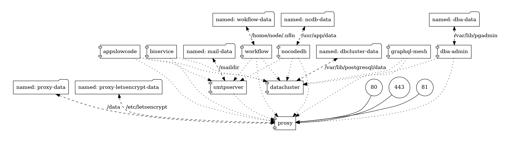

# Предметная область как сервис

ключевые принципы 

* Workflow - "только владелец процесса знает - какой процесс он хочет выстроить и какими данными он будет оперировать"
* LowCode - "только владелец процесса знает - какие приложения ему нужны, чтобы автоматизировать процесс"
* NoCode - "только владелец процесса знает - какие данные и с чем связаны"
* BI - "только владелец процесса знает - каким способом он будет визуализировать свой процесс для контроля качества"

А что же делать разработчикам ? Правильно - кодить инструменты для владельца процесса соблюдая проектные спецификации в виде API

## Использование

* установить Linux или WSL2 c установленной утилитой make и подсистемой Docker и поставьте `asdf`
    * рекомендовано использование ASDF с ZSh+OMySH https://asdf-vm.com/guide/getting-started.html#_3-install-asdf
* настройте сервисы под окружение `bash 01-prepare-settings.sh -e dev` или `bash 01-prepare-settings.sh -e prod`
* укажите адреса получившихся файлов настройки `cp .env.example.settings .env.settings`
* заполните настройки в каталоге [settings](./settings/) (для разработки - оставьте по умолчанию - если хотите)
* выполните команду `make deploy`

## Локальная первичная настройка

* первичный скрипт развертывания автоматически создает доменные имена для сервисов в DNS зоне - для разработческого стенда это `*.localhost`
   * зайдите по адресу http://proxy.localhost/nginx/proxy чтобы проверить как работает прокси-сервер
   * зайдите по адресу http://dba.localhost/browser/
      * добавьте сервер с DNS адресом `datacluster` и суперпользователем которого вы указали в настройках 
   * зайдите по адресу http://api.localhost/console/data/manage для проверки доступности API
   * зайдите по адресу http://bi.localhost/ - это будет ваша встраиваемая панель метрик
   * зайдите по адресу http://tables.localhost - это будет ваш комплект с данными предметной области
   * зайдите по адресу http://workflow.localhost/workflows - это будет ваше средство управление процессом автоматизации
   * зайдите по адресу http://apps.localhost - это будет ваш конструктор приложение
   * зайдите по адресу http://mails.localhost/ - это будет ваш сервер рассылки почты с отладкой HTML отображения
 
## Технологический состав

* Nginx Proxy Manager - чтобы научить системных администраторов не открывать порты из Docker на публичном IP
* Hasura - чтобы научить фронтендеров умению работать с GraphQL между различными реальными источниками
* PostgreSQL 15.x - чтобы научить администраторов расширенниям PostgreSQL
* n8n worflow - чтобы научить системных аналитиков системному мышлению проектирую связи между предметными областями
* nocodb - чтобы научить тестированию на примерах данных
* tooljet - чтобы научить бизнес-аналитиков проектироваю будущих корпоративных приложений
* metabase - чтобы научить инженеров по данным проектировать "панели контроля"
* mailhog - чтобы научить разработчиков тестировать отправку писем для аутентификации, а системных администраторов настраивать relay

> технологический состав может поменяться, функции приложений нет

> размер образов для развертывания - около 7 Gb

