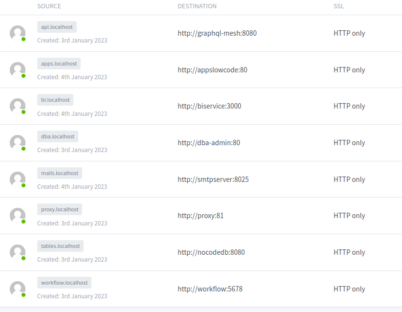

# Предметная область как сервис

ключевые принципы 

* Workflow - "только владелец процесса знает - какой процесс он хочет выстроить и какими данными он будет оперировать"
* LowCode - "только владелец процесса знает - какие приложения ему нужны, чтобы автоматизировать процесс"
* NoCode - "только владелец процесса знает - какие данные и с чем связаны"
* BI - "только владелец процесса знает - каким способом он будет визуализировать свой процесс для контроля качества"

А что же делать разработчикам ? Правильно - кодить инструменты для владельца процесса соблюдая проектные спецификации в виде API

## Использование

* установить Linux или WSL2 c установленной утилитой make и подсистемой Docker
* выполните команду `make deploy`

## Локальная первичная настройка

* системный администратор - http://localhost:81
    * зайдите под именем `admin@example.com` и паролем `changeme` для изменения пароля
    * добавьте прокси доменного имени `proxy.localhost` указывающего внутрь docker сети на DNS имя `proxy` и порт `81`
    * зайдите по адресу http://proxy.localhost/nginx/proxy чтобы проверить как работает прокси-сервер
    * добавьте прокси доменного имени `dba.localhost` указывающего внутрь docker сети на DNS имя `dba-admin` и порт `80`
    * добавьте прокси доменного имени `api.localhost` указывающего внутрь docker сети на DNS имя `graphql-mesh` и порт `8080`
    * добавьте прокси доменного имени `tables.localhost` указывающего внутрь docker сети на DNS имя `nocodedb` и порт `8080`
    * добавьте прокси доменного имени `workflow.localhost` указывающего внутрь docker сети на DNS имя `workflow` и порт `5678`
    * добавьте прокси доменного имени `apps.localhost` указывающего внутрь docker сети на DNS имя `appslowcode` и порт `5678`
    * добавьте прокси доменного имени `bi.localhost` указывающего внутрь docker сети на DNS имя `biservice` и порт `3000`
    * добавьте прокси доменного имени `mails.localhost` указывающего внутрь docker сети на DNS имя `smtpserver` и порт `8025`
* зайдите по адресу http://dba.localhost/browser/
    * добавьте сервер с DNS адресом `datacluster` с пользователем `superdba` и паролем `postgrespassword`
* зайдите по адресу http://api.localhost/console/data/manage для проверки доступности API
* зайдите по адресу http://bi.localhost/ - это будет ваша встраиваемая панель метрик
* зайдите по адресу http://tables.localhost - это будет ваш комплект с данными предметной области
* зайдите по адресу http://workflow.localhost/workflows - это будет ваше средство управление процессом автоматизации
* зайдите по адресу http://apps.localhost - это будет ваш конструктор приложение
 
## Технологический состав

* Nginx Proxy Manager - чтобы научить системных администраторов не открывать порты из Docker на публичном IP
* Hasura - чтобы научить фронтендеров умению работать с GraphQL между различными реальными источниками
* PostgreSQL 15.x - чтобы научить администраторов расширенниям PostgreSQL
* n8n worflow - чтобы научить системных аналитиков системному мышлению проектирую связи между предметными областями
* nocodb - чтобы научить тестированию на примерах данных
* tooljet - чтобы научить бизнес-аналитиков проектироваю будущих корпоративных приложений
* metabase - чтобы научить инженеров по данным проектировать "панели контроля"
* mailhog - чтобы научить разработчиков тестировать отправку писем для аутентификации, а системных администраторов настраивать relay

> технологический состав может поменяться, функции приложений нет

> размер образов для развертывания - около 7 Gb

